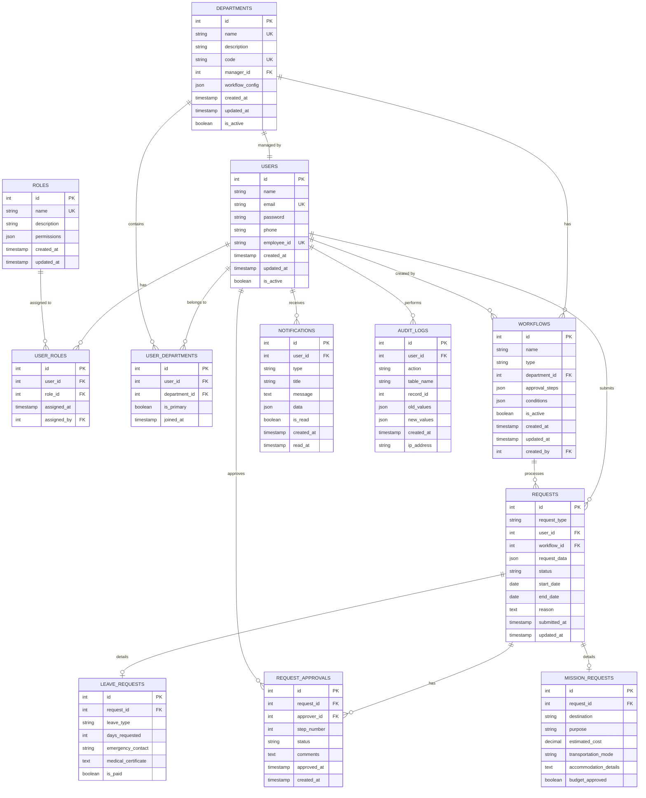

# Database Schema

```mermaid
erDiagram
    USERS {
        int id PK
        string name
        string email UK
        string password
        string phone
        string employee_id UK
        timestamp created_at
        timestamp updated_at
        boolean is_active
    }

    ROLES {
        int id PK
        string name UK
        string description
        json permissions
        timestamp created_at
        timestamp updated_at
    }

    DEPARTMENTS {
        int id PK
        string name UK
        string description
        string code UK
        int manager_id FK
        json workflow_config
        timestamp created_at
        timestamp updated_at
        boolean is_active
    }

    USER_ROLES {
        int id PK
        int user_id FK
        int role_id FK
        timestamp assigned_at
        int assigned_by FK
    }

    USER_DEPARTMENTS {
        int id PK
        int user_id FK
        int department_id FK
        boolean is_primary
        timestamp joined_at
    }

    WORKFLOWS {
        int id PK
        string name
        string type
        int department_id FK
        json approval_steps
        json conditions
        boolean is_active
        timestamp created_at
        timestamp updated_at
        int created_by FK
    }

    REQUESTS {
        int id PK
        string request_type
        int user_id FK
        int workflow_id FK
        json request_data
        string status
        date start_date
        date end_date
        text reason
        timestamp submitted_at
        timestamp updated_at
    }

    REQUEST_APPROVALS {
        int id PK
        int request_id FK
        int approver_id FK
        int step_number
        string status
        text comments
        timestamp approved_at
        timestamp created_at
    }

    LEAVE_REQUESTS {
        int id PK
        int request_id FK
        string leave_type
        int days_requested
        string emergency_contact
        text medical_certificate
        boolean is_paid
    }

    MISSION_REQUESTS {
        int id PK
        int request_id FK
        string destination
        string purpose
        decimal estimated_cost
        string transportation_mode
        text accommodation_details
        boolean budget_approved
    }

    NOTIFICATIONS {
        int id PK
        int user_id FK
        string type
        string title
        text message
        json data
        boolean is_read
        timestamp created_at
        timestamp read_at
    }

    AUDIT_LOGS {
        int id PK
        int user_id FK
        string action
        string table_name
        int record_id
        json old_values
        json new_values
        timestamp created_at
        string ip_address
    }

    %% Relationships
    USERS ||--o{ USER_ROLES : "has"
    ROLES ||--o{ USER_ROLES : "assigned to"
    USERS ||--o{ USER_DEPARTMENTS : "belongs to"
    DEPARTMENTS ||--o{ USER_DEPARTMENTS : "contains"
    DEPARTMENTS ||--|| USERS : "managed by"
    DEPARTMENTS ||--o{ WORKFLOWS : "has"
    USERS ||--o{ WORKFLOWS : "created by"
    USERS ||--o{ REQUESTS : "submits"
    WORKFLOWS ||--o{ REQUESTS : "processes"
    REQUESTS ||--o{ REQUEST_APPROVALS : "has"
    USERS ||--o{ REQUEST_APPROVALS : "approves"
    REQUESTS ||--o| LEAVE_REQUESTS : "details"
    REQUESTS ||--o| MISSION_REQUESTS : "details"
    USERS ||--o{ NOTIFICATIONS : "receives"
    USERS ||--o{ AUDIT_LOGS : "performs"
```
