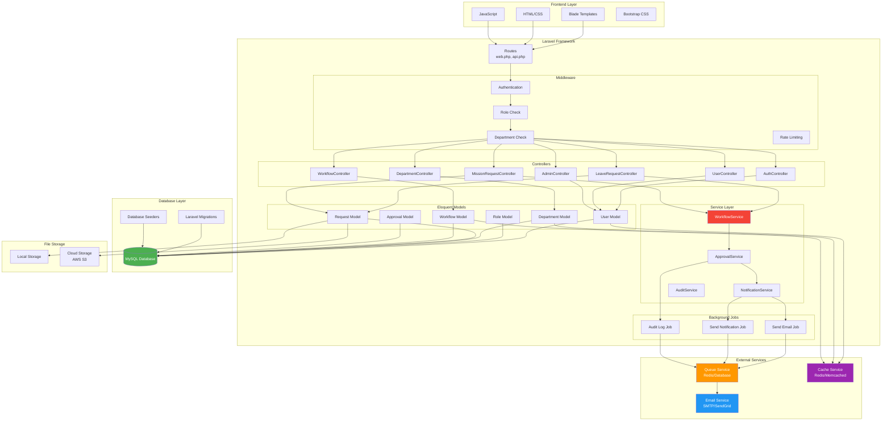

# Laravel System Architecture

```mermaid
graph TB
    %% Frontend Layer
    subgraph "Frontend Layer"
        BLADE[Blade Templates]
        HTML[HTML/CSS]
        JS[JavaScript]
        BOOTSTRAP[Bootstrap CSS]
    end

    %% Laravel Framework
    subgraph "Laravel Framework"
        %% Routes
        ROUTES[Routes<br/>web.php, api.php]

        %% Controllers
        subgraph "Controllers"
            AUTH_CTRL[AuthController]
            USER_CTRL[UserController]
            DEPT_CTRL[DepartmentController]
            LEAVE_CTRL[LeaveRequestController]
            MISSION_CTRL[MissionRequestController]
            WORKFLOW_CTRL[WorkflowController]
            ADMIN_CTRL[AdminController]
        end

        %% Middleware
        subgraph "Middleware"
            AUTH_MW[Authentication]
            ROLE_MW[Role Check]
            DEPT_MW[Department Check]
            THROTTLE[Rate Limiting]
        end

        %% Models
        subgraph "Eloquent Models"
            USER_MODEL[User Model]
            ROLE_MODEL[Role Model]
            DEPT_MODEL[Department Model]
            REQUEST_MODEL[Request Model]
            WORKFLOW_MODEL[Workflow Model]
            APPROVAL_MODEL[Approval Model]
        end

        %% Services
        subgraph "Service Layer"
            WORKFLOW_SVC[WorkflowService]
            APPROVAL_SVC[ApprovalService]
            NOTIFICATION_SVC[NotificationService]
            AUDIT_SVC[AuditService]
        end

        %% Jobs & Queues
        subgraph "Background Jobs"
            EMAIL_JOB[Send Email Job]
            NOTIFICATION_JOB[Send Notification Job]
            AUDIT_JOB[Audit Log Job]
        end
    end

    %% Database Layer
    subgraph "Database Layer"
        MYSQL[(MySQL Database)]
        MIGRATIONS[Laravel Migrations]
        SEEDERS[Database Seeders]
    end

    %% External Services
    subgraph "External Services"
        EMAIL_SVC[Email Service<br/>SMTP/SendGrid]
        QUEUE_SVC[Queue Service<br/>Redis/Database]
        CACHE[Cache Service<br/>Redis/Memcached]
    end

    %% File Storage
    subgraph "File Storage"
        LOCAL_STORAGE[Local Storage]
        CLOUD_STORAGE[Cloud Storage<br/>AWS S3]
    end

    %% Flow Connections
    BLADE --> ROUTES
    HTML --> ROUTES
    JS --> ROUTES

    ROUTES --> AUTH_MW
    AUTH_MW --> ROLE_MW
    ROLE_MW --> DEPT_MW

    DEPT_MW --> AUTH_CTRL
    DEPT_MW --> USER_CTRL
    DEPT_MW --> DEPT_CTRL
    DEPT_MW --> LEAVE_CTRL
    DEPT_MW --> MISSION_CTRL
    DEPT_MW --> WORKFLOW_CTRL
    DEPT_MW --> ADMIN_CTRL

    AUTH_CTRL --> USER_MODEL
    USER_CTRL --> USER_MODEL
    DEPT_CTRL --> DEPT_MODEL
    LEAVE_CTRL --> REQUEST_MODEL
    MISSION_CTRL --> REQUEST_MODEL
    WORKFLOW_CTRL --> WORKFLOW_MODEL
    ADMIN_CTRL --> USER_MODEL

    USER_MODEL --> MYSQL
    ROLE_MODEL --> MYSQL
    DEPT_MODEL --> MYSQL
    REQUEST_MODEL --> MYSQL
    WORKFLOW_MODEL --> MYSQL
    APPROVAL_MODEL --> MYSQL

    LEAVE_CTRL --> WORKFLOW_SVC
    MISSION_CTRL --> WORKFLOW_SVC
    WORKFLOW_SVC --> APPROVAL_SVC
    APPROVAL_SVC --> NOTIFICATION_SVC

    NOTIFICATION_SVC --> EMAIL_JOB
    NOTIFICATION_SVC --> NOTIFICATION_JOB
    APPROVAL_SVC --> AUDIT_JOB

    EMAIL_JOB --> QUEUE_SVC
    NOTIFICATION_JOB --> QUEUE_SVC
    AUDIT_JOB --> QUEUE_SVC

    QUEUE_SVC --> EMAIL_SVC

    MIGRATIONS --> MYSQL
    SEEDERS --> MYSQL

    REQUEST_MODEL --> LOCAL_STORAGE
    REQUEST_MODEL --> CLOUD_STORAGE

    %% Caching
    USER_MODEL --> CACHE
    DEPT_MODEL --> CACHE
    WORKFLOW_MODEL --> CACHE

    %% Styling
    style MYSQL fill:#4caf50,color:#fff
    style QUEUE_SVC fill:#ff9800,color:#fff
    style EMAIL_SVC fill:#2196f3,color:#fff
    style CACHE fill:#9c27b0,color:#fff
    style WORKFLOW_SVC fill:#f44336,color:#fff
```
