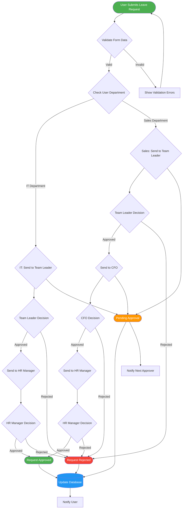

# Leave Request Workflow

```mermaid
graph TD
    %% Start Process
    START([User Submits Leave Request])

    %% Form Validation
    VALIDATE{Validate Form Data}
    INVALID[Show Validation Errors]

    %% Department Check
    DEPT_CHECK{Check User Department}

    %% IT Department Flow
    IT_TL{IT: Send to Team Leader}
    IT_TL_DECISION{Team Leader Decision}
    IT_HR{Send to HR Manager}
    IT_HR_DECISION{HR Manager Decision}

    %% Sales Department Flow
    SALES_TL{Sales: Send to Team Leader}
    SALES_TL_DECISION{Team Leader Decision}
    SALES_CFO{Send to CFO}
    SALES_CFO_DECISION{CFO Decision}
    SALES_HR{Send to HR Manager}
    SALES_HR_DECISION{HR Manager Decision}

    %% Final States
    APPROVED([Request Approved])
    REJECTED([Request Rejected])
    PENDING([Pending Approval])

    %% Notifications
    NOTIFY_USER[Notify User]
    NOTIFY_NEXT[Notify Next Approver]
    UPDATE_DB[(Update Database)]

    %% Flow
    START --> VALIDATE
    VALIDATE -->|Valid| DEPT_CHECK
    VALIDATE -->|Invalid| INVALID
    INVALID --> START

    %% Department Routing
    DEPT_CHECK -->|IT Department| IT_TL
    DEPT_CHECK -->|Sales Department| SALES_TL

    %% IT Department Process
    IT_TL --> IT_TL_DECISION
    IT_TL_DECISION -->|Approved| IT_HR
    IT_TL_DECISION -->|Rejected| REJECTED

    IT_HR --> IT_HR_DECISION
    IT_HR_DECISION -->|Approved| APPROVED
    IT_HR_DECISION -->|Rejected| REJECTED

    %% Sales Department Process
    SALES_TL --> SALES_TL_DECISION
    SALES_TL_DECISION -->|Approved| SALES_CFO
    SALES_TL_DECISION -->|Rejected| REJECTED

    SALES_CFO --> SALES_CFO_DECISION
    SALES_CFO_DECISION -->|Approved| SALES_HR
    SALES_CFO_DECISION -->|Rejected| REJECTED

    SALES_HR --> SALES_HR_DECISION
    SALES_HR_DECISION -->|Approved| APPROVED
    SALES_HR_DECISION -->|Rejected| REJECTED

    %% Pending State for intermediate approvals
    IT_TL --> PENDING
    SALES_TL --> PENDING
    SALES_CFO --> PENDING

    %% Database and Notifications
    APPROVED --> UPDATE_DB
    REJECTED --> UPDATE_DB
    PENDING --> UPDATE_DB

    UPDATE_DB --> NOTIFY_USER
    PENDING --> NOTIFY_NEXT

    %% Styling
    style START fill:#4caf50,color:#fff
    style APPROVED fill:#4caf50,color:#fff
    style REJECTED fill:#f44336,color:#fff
    style PENDING fill:#ff9800,color:#fff
    style UPDATE_DB fill:#2196f3,color:#fff
```
