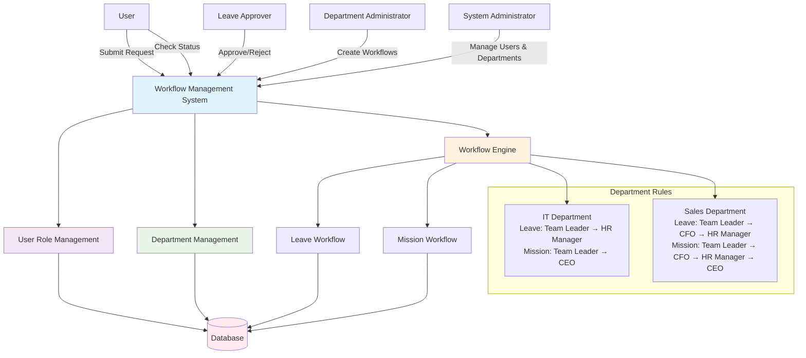

# Workflow Management System - System Overview

```mermaid
graph TB
    %% User Roles
    U[User]
    LA[Leave Approver]
    DA[Department Administrator]
    SA[System Administrator]

    %% Main System Components
    WMS[Workflow Management System]
    URM[User Role Management]
    DM[Department Management]
    WE[Workflow Engine]

    %% Core Workflows
    LW[Leave Workflow]
    MW[Mission Workflow]

    %% Database
    DB[(Database)]

    %% User Interactions
    U --> |Submit Request| WMS
    U --> |Check Status| WMS
    LA --> |Approve/Reject| WMS
    DA --> |Create Workflows| WMS
    SA --> |Manage Users & Departments| WMS

    %% System Flow
    WMS --> URM
    WMS --> DM
    WMS --> WE

    URM --> DB
    DM --> DB
    WE --> LW
    WE --> MW

    LW --> DB
    MW --> DB

    %% Department Specific Rules
    subgraph "Department Rules"
        IT[IT Department<br/>Leave: Team Leader → HR Manager<br/>Mission: Team Leader → CEO]
        SALES[Sales Department<br/>Leave: Team Leader → CFO → HR Manager<br/>Mission: Team Leader → CFO → HR Manager → CEO]
    end

    WE --> IT
    WE --> SALES

    style WMS fill:#e1f5fe
    style URM fill:#f3e5f5
    style DM fill:#e8f5e8
    style WE fill:#fff3e0
    style DB fill:#ffebee
```
