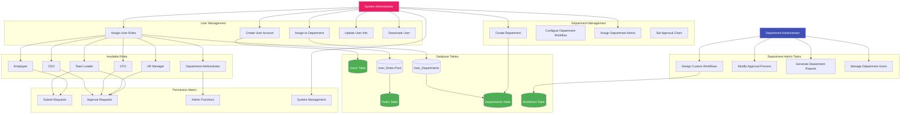

# User Role Management

```mermaid
graph TB
    %% System Administrator Functions
    SA[System Administrator]

    %% User Management
    subgraph "User Management"
        CREATE_USER[Create User Account]
        ASSIGN_ROLE[Assign User Roles]
        ASSIGN_DEPT[Assign to Department]
        UPDATE_USER[Update User Info]
        DEACTIVATE[Deactivate User]
    end

    %% Role Types
    subgraph "Available Roles"
        EMPLOYEE[Employee]
        TEAM_LEADER[Team Leader]
        HR_MANAGER[HR Manager]
        CFO[CFO]
        CEO[CEO]
        DEPT_ADMIN[Department Administrator]
    end

    %% Department Management
    subgraph "Department Management"
        CREATE_DEPT[Create Department]
        CONFIG_WORKFLOW[Configure Department Workflow]
        ASSIGN_ADMIN[Assign Department Admin]
        SET_APPROVERS[Set Approval Chain]
    end

    %% Department Administrator Functions
    DA[Department Administrator]

    subgraph "Department Admin Tasks"
        DESIGN_WORKFLOW[Design Custom Workflows]
        MODIFY_APPROVAL[Modify Approval Process]
        DEPT_REPORTS[Generate Department Reports]
        MANAGE_DEPT_USERS[Manage Department Users]
    end

    %% Database Structure
    subgraph "Database Tables"
        USERS_TABLE[(Users Table)]
        ROLES_TABLE[(Roles Table)]
        DEPT_TABLE[(Departments Table)]
        WORKFLOW_TABLE[(Workflows Table)]
        USER_ROLES[(User_Roles Pivot)]
        USER_DEPT[(User_Departments)]
    end

    %% System Admin Connections
    SA --> CREATE_USER
    SA --> ASSIGN_ROLE
    SA --> ASSIGN_DEPT
    SA --> UPDATE_USER
    SA --> DEACTIVATE
    SA --> CREATE_DEPT
    SA --> ASSIGN_ADMIN

    %% Role Assignments
    ASSIGN_ROLE --> EMPLOYEE
    ASSIGN_ROLE --> TEAM_LEADER
    ASSIGN_ROLE --> HR_MANAGER
    ASSIGN_ROLE --> CFO
    ASSIGN_ROLE --> CEO
    ASSIGN_ROLE --> DEPT_ADMIN

    %% Department Admin Connections
    DA --> DESIGN_WORKFLOW
    DA --> MODIFY_APPROVAL
    DA --> DEPT_REPORTS
    DA --> MANAGE_DEPT_USERS

    %% Database Connections
    CREATE_USER --> USERS_TABLE
    ASSIGN_ROLE --> USER_ROLES
    ASSIGN_DEPT --> USER_DEPT
    CREATE_DEPT --> DEPT_TABLE
    DESIGN_WORKFLOW --> WORKFLOW_TABLE

    USER_ROLES --> ROLES_TABLE
    USER_DEPT --> DEPT_TABLE

    %% Permission Flow
    subgraph "Permission Matrix"
        PERM_SUBMIT[Submit Requests]
        PERM_APPROVE[Approve Requests]
        PERM_ADMIN[Admin Functions]
        PERM_SYSTEM[System Management]
    end

    EMPLOYEE --> PERM_SUBMIT
    TEAM_LEADER --> PERM_SUBMIT
    TEAM_LEADER --> PERM_APPROVE
    HR_MANAGER --> PERM_APPROVE
    CFO --> PERM_APPROVE
    CEO --> PERM_APPROVE
    DEPT_ADMIN --> PERM_ADMIN
    SA --> PERM_SYSTEM

    %% Styling
    style SA fill:#e91e63,color:#fff
    style DA fill:#3f51b5,color:#fff
    style USERS_TABLE fill:#4caf50,color:#fff
    style ROLES_TABLE fill:#4caf50,color:#fff
    style DEPT_TABLE fill:#4caf50,color:#fff
    style WORKFLOW_TABLE fill:#4caf50,color:#fff
```
